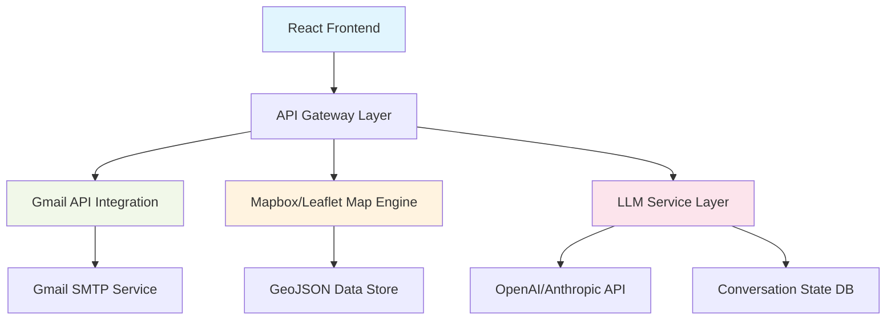
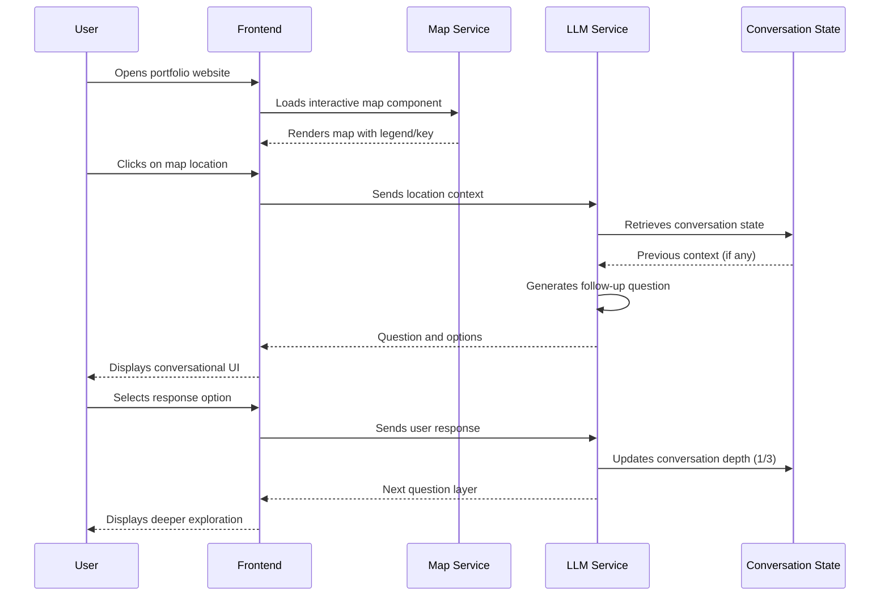
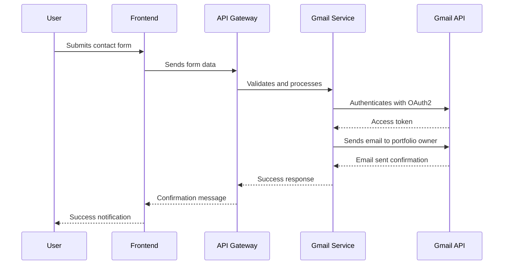

# Design Document: Portfolio Enhancements

## Overview

This design document outlines enhancements for a React/TypeScript portfolio website featuring Gmail integration for contact form activation, interactive geospatial visualization showcasing Geo Spatial Data Engineer and Cloud Engineer expertise, and an LLM-powered conversational search interface. The system integrates with Gmail API for contact form submissions, implements an interactive map metaphor for personal exploration with legend/key functionality, and provides a multi-layer conversational AI that asks follow-up questions up to three levels deep to help visitors explore the portfolio content.

The portfolio is built as a React/TypeScript application using shadcn/ui components with a modern design aesthetic and existing contact infrastructure requiring Gmail API integration.

## Architecture



The architecture follows a client-server model with the React frontend communicating through an API gateway layer to various backend services. The system leverages existing React/TypeScript infrastructure while adding specialized services for Gmail, geospatial visualization, and conversational AI.

## Sequence Diagrams

### Main User Flow: Interactive Map Exploration



### Gmail Integration Flow



## Components and Interfaces

### Component 1: EnhancedContactSection

**Purpose**: Extends existing contact section with Gmail API integration

**Interface**:
```typescript
interface EnhancedContactSectionProps {
  onEmailSent: (result: EmailResult) => void;
  gmailConfig: GmailConfig;
}

interface GmailConfig {
  clientId: string;
  clientSecret: string;
  refreshToken: string;
  portfolioOwnerEmail: string;
}

interface EmailResult {
  success: boolean;
  messageId?: string;
  error?: string;
}
```

**Responsibilities**:
- Render contact form with improved validation
- Handle Gmail OAuth2 authentication flow
- Send emails via Gmail API
- Provide real-time feedback to users
- Maintain email sending state and retry logic

### Component 2: InteractiveMapExplorer

**Purpose**: Visual geospatial representation of portfolio content with interactive exploration

**Interface**:
```typescript
interface InteractiveMapExplorerProps {
  initialViewport: MapViewport;
  geojsonData: GeoJSON.FeatureCollection;
  onLocationSelect: (location: MapLocation) => void;
  showLegend: boolean;
  theme?: MapTheme;
}

interface MapViewport {
  latitude: number;
  longitude: number;
  zoom: number;
}

interface MapLocation {
  id: string;
  name: string;
  coordinates: [number, number];
  category: PortfolioCategory;
  metadata: MapMetadata;
}

interface MapMetadata {
  skills: string[];
  projects: string[];
  experienceLevel: number;
  description: string;
}
```

**Responsibilities**:
- Render interactive map using Mapbox/Leaflet
- Display legend/key for map interpretation
- Handle user interactions (click, hover, zoom)
- Animate transitions between locations
- Manage map state and viewport
- Integrate with LLM for contextual responses

### Component 3: LLMConversationSearch

**Purpose**: Multi-layer conversational AI interface for portfolio exploration

**Interface**:
```typescript
interface LLMConversationSearchProps {
  apiKey: string;
  model: LLMModel;
  maxDepth: number; // Default: 3
  initialContext?: ConversationContext;
  onConversationUpdate: (state: ConversationState) => void;
}

interface ConversationState {
  depth: number; // 0-3
  currentQuestion: string;
  options: ConversationOption[];
  history: ConversationTurn[];
  context: PortfolioContext;
}

interface ConversationTurn {
  role: 'user' | 'assistant';
  content: string;
  timestamp: Date;
}

interface PortfolioContext {
  selectedLocation?: MapLocation;
  interestArea?: string[];
  skillFocus?: string[];
  projectType?: string;
}
```

**Responsibilities**:
- Manage multi-turn conversation state
- Generate context-aware follow-up questions
- Handle user responses and update context
- Maintain conversation depth limits
- Provide natural language interaction
- Integrate with map for spatial context

## Data Models

### Model 1: PortfolioGeoJSON

```typescript
interface PortfolioGeoJSON extends GeoJSON.FeatureCollection {
  features: PortfolioFeature[];
  metadata: PortfolioMetadata;
}

interface PortfolioFeature extends GeoJSON.Feature {
  geometry: GeoJSON.Point;
  properties: PortfolioProperties;
  id: string;
}

interface PortfolioProperties {
  title: string;
  description: string;
  category: 'skill' | 'project' | 'experience' | 'education';
  skillLevel?: number; // 1-5
  technologies: string[];
  cloudServices: string[];
  geospatialTools: string[];
  year: number;
  link?: string;
  thumbnail?: string;
}

interface PortfolioMetadata {
  title: string;
  description: string;
  author: string;
  legend: LegendItem[];
}

interface LegendItem {
  label: string;
  color: string;
  icon: string;
  description: string;
}
```

**Validation Rules**:
- All features must have valid GeoJSON Point geometry
- Required properties: title, category, technologies
- Skill level must be 1-5 if category is 'skill'
- Cloud services and geospatial tools arrays cannot be empty for relevant categories

### Model 2: ConversationSchema

```typescript
interface ConversationSchema {
  sessionId: string;
  userId?: string;
  depth: number; // 0-3
  turns: ConversationTurn[];
  context: ConversationContext;
  metadata: ConversationMetadata;
}

interface ConversationTurn {
  id: string;
  role: 'user' | 'assistant';
  content: string;
  timestamp: Date;
  options?: string[]; // For assistant turns with choices
  selectedOption?: string; // For user turns with selection
}

interface ConversationContext {
  location?: MapLocation;
  focusArea?: 'skills' | 'projects' | 'experience' | 'all';
  techStack?: string[];
  cloudPlatform?: 'aws' | 'azure' | 'gcp' | 'multi';
  experienceLevel?: 'beginner' | 'intermediate' | 'advanced' | 'expert';
}

interface ConversationMetadata {
  startTime: Date;
  lastActivity: Date;
  completionStatus: 'active' | 'completed' | 'abandoned';
}
```

**Validation Rules**:
- Depth must be between 0 and 3 inclusive
- Each turn must have valid timestamp
- User turns must follow assistant turns (alternating)
- Context must be consistent throughout conversation

## Algorithmic Pseudocode

### Main Processing Algorithm

```pascal
ALGORITHM processConversationFlow(userInput, currentState)
INPUT: userInput of type UserInput, currentState of type ConversationState
OUTPUT: updatedState of type ConversationState

BEGIN
  ASSERT validateUserInput(userInput) = true
  ASSERT currentState.depth < 3
  
  // Step 1: Update conversation history
  userTurn ← createUserTurn(userInput, currentState)
  updatedState.history.add(userTurn)
  
  // Step 2: Analyze context and generate response
  context ← analyzeConversationContext(updatedState)
  
  // Step 3: Generate follow-up question based on depth
  IF currentState.depth = 0 THEN
    question ← generateInitialQuestion(context)
    options ← generateBroadOptions(context)
  ELSE IF currentState.depth = 1 THEN
    question ← generateClarifyingQuestion(context, userInput)
    options ← generateDetailedOptions(context)
  ELSE IF currentState.depth = 2 THEN
    question ← generateDeepDiveQuestion(context, userInput)
    options ← generateSpecializedOptions(context)
  END IF
  
  // Step 4: Create assistant turn
  assistantTurn ← createAssistantTurn(question, options)
  updatedState.history.add(assistantTurn)
  
  // Step 5: Update state
  updatedState.currentQuestion ← question
  updatedState.options ← options
  updatedState.depth ← currentState.depth + 1
  updatedState.context ← updateContext(context, userInput)
  
  // Validate final state
  ASSERT updatedState.depth = currentState.depth + 1
  ASSERT updatedState.history.length = currentState.history.length + 2
  ASSERT updatedState.currentQuestion ≠ ""
  
  RETURN updatedState
END
```

**Preconditions**:
- userInput is validated and non-empty
- currentState.depth < 3 (maximum depth)
- Conversation context is well-formed
- LLM service is available and responsive

**Postconditions**:
- Conversation depth increased by 1
- Two turns added to history (user + assistant)
- Updated context reflects user input
- Current question and options set appropriately
- Maximum depth constraint respected

**Loop Invariants**:
- History alternates between user and assistant turns
- Depth increment is monotonic and bounded
- Context evolution is consistent with conversation flow

### Map Interaction Algorithm

```pascal
ALGORITHM handleMapLocationSelection(location, mapState)
INPUT: location of type MapLocation, mapState of type MapState
OUTPUT: updatedConversationState of type ConversationState

BEGIN
  // Validate input
  ASSERT location ≠ null
  ASSERT validateMapLocation(location) = true
  
  // Update map visualization
  updatedMapState ← highlightLocation(location, mapState)
  
  // Extract context from location metadata
  context ← extractLocationContext(location)
  
  // Generate conversation based on location category
  IF location.category = 'skill' THEN
    conversationContext ← createSkillContext(location)
  ELSE IF location.category = 'project' THEN
    conversationContext ← createProjectContext(location)
  ELSE IF location.category = 'experience' THEN
    conversationContext ← createExperienceContext(location)
  ELSE
    conversationContext ← createGeneralContext(location)
  END IF
  
  // Initialize conversation with location context
  updatedConversationState ← initializeConversation(conversationContext)
  
  // Update map legend focus
  updatedMapState.legend.activeItem ← getLegendItemForCategory(location.category)
  
  // Validate output
  ASSERT updatedConversationState.depth = 0
  ASSERT updatedConversationState.context.location = location
  ASSERT updatedMapState.highlightedLocation = location
  
  RETURN updatedConversationState
END
```

**Preconditions**:
- location is valid MapLocation object
- mapState is current map visualization state
- Map rendering engine is initialized

**Postconditions**:
- Map highlights selected location
- Conversation initialized with location context
- Legend updated to reflect active category
- Conversation depth starts at 0 for new location

**Loop Invariants**:
- Only one location can be highlighted at a time
- Legend state consistent with highlighted location
- Conversation context matches location metadata

## Key Functions with Formal Specifications

### Function 1: sendGmailContact(formData, config)

```typescript
async function sendGmailContact(
  formData: ContactFormData,
  config: GmailConfig
): Promise<EmailResult>
```

**Preconditions**:
- `formData` contains valid name, email, subject, and message fields
- `formData.email` is properly formatted email address
- `config` contains valid Gmail OAuth2 credentials
- Network connectivity is available
- Gmail API quota not exceeded

**Postconditions**:
- Returns `EmailResult` with success status
- If successful: `result.success === true` and `result.messageId` contains Gmail message ID
- If error: `result.error` contains descriptive error message
- Email sent to portfolio owner's Gmail account
- No side effects on input parameters
- Authentication tokens refreshed if expired

**Loop Invariants**: N/A (no loops in this function)

### Function 2: generateFollowUpQuestion(context, depth)

```typescript
function generateFollowUpQuestion(
  context: ConversationContext,
  depth: number
): GeneratedQuestion
```

**Preconditions**:
- `context` is valid ConversationContext object
- `depth` is integer between 0 and 2 inclusive
- LLM API key is configured and valid
- Context contains sufficient information for question generation

**Postconditions**:
- Returns `GeneratedQuestion` object with question text and options
- Question is relevant to conversation context and depth
- Options array contains 2-4 meaningful choices
- Question helps close knowledge gaps based on current context
- No mutations to input parameters

**Loop Invariants**: 
- Question relevance increases with depth
- Options become more specific as depth increases
- Context evolution follows logical progression

### Function 3: renderInteractiveMap(geojson, viewport, handlers)

```typescript
function renderInteractiveMap(
  geojson: PortfolioGeoJSON,
  viewport: MapViewport,
  handlers: MapEventHandlers
): MapRenderer
```

**Preconditions**:
- `geojson` is valid PortfolioGeoJSON feature collection
- `viewport` contains valid latitude, longitude, and zoom values
- `handlers` contains functions for all required map events
- Map library (Mapbox/Leaflet) is loaded
- Container element exists in DOM

**Postconditions**:
- Returns `MapRenderer` instance with control methods
- Map is rendered with all features from geojson
- Legend is displayed if `geojson.metadata.legend` exists
- Event handlers are properly attached
- Viewport is set to specified location and zoom
- No memory leaks from map resources

**Loop Invariants**:
- Map features remain visible within viewport bounds
- Legend items correspond to visible features
- Event handlers maintain consistent behavior

## Example Usage

```typescript
// Example 1: Gmail integration
const contactForm = {
  name: "John Doe",
  email: "john@example.com",
  subject: "Project Inquiry",
  message: "I'd like to discuss a geospatial data engineering project."
};

const gmailConfig = {
  clientId: process.env.GMAIL_CLIENT_ID,
  clientSecret: process.env.GMAIL_CLIENT_SECRET,
  refreshToken: process.env.GMAIL_REFRESH_TOKEN,
  portfolioOwnerEmail: "jasemwaura@gmail.com"
};

const result = await sendGmailContact(contactForm, gmailConfig);
if (result.success) {
  console.log(`Email sent with ID: ${result.messageId}`);
} else {
  console.error(`Failed to send email: ${result.error}`);
}

// Example 2: Interactive map exploration
const mapExplorer = new InteractiveMapExplorer({
  initialViewport: { latitude: -1.286389, longitude: 36.817223, zoom: 10 }, // Nairobi
  geojsonData: portfolioGeoJSON,
  onLocationSelect: (location) => {
    const conversation = handleMapLocationSelection(location, mapState);
    setConversationState(conversation);
  },
  showLegend: true,
  theme: 'dark'
});

// Example 3: LLM conversation flow
const llmSearch = new LLMConversationSearch({
  apiKey: process.env.OPENAI_API_KEY,
  model: 'gpt-4',
  maxDepth: 3,
  initialContext: {
    selectedLocation: spatialEngineeringLocation,
    interestArea: ['geospatial', 'cloud']
  },
  onConversationUpdate: (state) => {
    console.log(`Depth: ${state.depth}, Question: ${state.currentQuestion}`);
    // Update UI with new question and options
  }
});

// Start conversation
const firstQuestion = await llmSearch.startConversation();
console.log(`Assistant: ${firstQuestion.currentQuestion}`);
console.log(`Options: ${firstQuestion.options.join(', ')}`);

// User selects an option
const updatedState = await llmSearch.processResponse({
  selectedOption: firstQuestion.options[0],
  additionalText: "Tell me more about your AWS geospatial experience"
});

console.log(`Follow-up: ${updatedState.currentQuestion}`);
```

## Correctness Properties

### Property 1: Email Delivery Guarantee  
**Validates: Requirements 2.1, 2.10**  
For all valid contact form submissions, the system must either successfully deliver the email via Gmail API or provide a clear error message within 5 seconds.

### Property 2: Conversation Depth Bound  
**Validates: Requirements 2.7**  
The LLM conversation must never exceed 3 layers of follow-up questions. Formally: ∀ conversation ∈ Conversations, conversation.depth ≤ 3.

### Property 3: Map-Legend Consistency  
**Validates: Requirements 2.5**  
For every map location displayed, there must exist a corresponding legend item. Formally: ∀ location ∈ Map.locations, ∃ legendItem ∈ Legend.items such that legendItem.category = location.category.

### Property 4: Context Preservation  
**Validates: Requirements 2.8**  
User context from map interactions must be preserved throughout the conversation. Formally: If conversation.context.location = L at time t, then conversation.context.location = L for all t' > t until location changes.

### Property 5: Gmail Authentication Security  
**Validates: Requirements 2.1, 3.2**  
Authentication tokens must be refreshed before expiration and never exposed to client-side code. Formally: Token refresh must occur when currentTime > token.expiryTime - 300 seconds.

## Error Handling

### Error Scenario 1: Gmail API Authentication Failure

**Condition**: OAuth2 token expired or invalid credentials
**Response**: Attempt automatic token refresh using refresh token. If refresh fails, return user-friendly error message.
**Recovery**: Provide alternative contact method (fallback email form) and log error for admin review.

### Error Scenario 2: Map Rendering Failure

**Condition**: Mapbox/Leaflet library fails to load or GeoJSON data invalid
**Response**: Display static map image with interactive elements disabled
**Recovery**: Attempt to reload map library after 3 seconds, up to 3 retries

### Error Scenario 3: LLM Service Unavailable

**Condition**: OpenAI/Anthropic API rate limit exceeded or service down
**Response**: Switch to predefined conversation flow with canned responses
**Recovery**: Implement exponential backoff retry with circuit breaker pattern

### Error Scenario 4: Conversation Depth Exceeded

**Condition**: User attempts to go beyond 3 layers of questions
**Response**: Gracefully end conversation and suggest starting new exploration
**Recovery**: Reset conversation state and offer summary of exploration

## Testing Strategy

### Unit Testing Approach

**Component Tests**:
- Contact form validation and submission
- Map interaction handlers
- Conversation state management
- Legend rendering and updates

**Service Tests**:
- Gmail API integration mocking
- LLM response generation (mock API calls)
- GeoJSON data validation
- Authentication token management

**Coverage Goals**: 80% line coverage, 90% branch coverage for critical paths

### Property-Based Testing Approach

**Property Test Library**: fast-check for TypeScript

**Key Properties to Test**:
1. **Email Idempotency**: Sending the same email twice should not create duplicates
2. **Conversation Monotonicity**: Conversation depth should only increase
3. **Map Selection Consistency**: Selecting a location then deselecting should return to initial state
4. **Context Preservation**: User context should persist through conversation turns
5. **Error Recovery**: System should recover from network failures within bounds

### Integration Testing Approach

**End-to-End Tests**:
- Complete user flow: Map interaction → Conversation → Contact
- Cross-browser compatibility testing
- Mobile responsiveness verification
- Performance under load (simultaneous users)

**API Integration Tests**:
- Gmail API connectivity and error handling
- Map service integration
- LLM API response parsing and error cases

## Performance Considerations

**Map Rendering Optimization**:
- Implement viewport-based feature clustering for large datasets
- Use vector tiles for smooth zooming and panning
- Lazy load map assets and GeoJSON data
- Implement debouncing for map interaction events

**LLM Response Caching**:
- Cache common conversation patterns and responses
- Implement response deduplication for similar queries
- Use streaming responses for better perceived performance
- Pre-generate initial questions for common locations

**Gmail Integration**:
- Batch email sending for multiple submissions
- Implement queue system for high traffic periods
- Use connection pooling for API requests
- Cache authentication tokens to reduce auth overhead

**Bundle Size Optimization**:
- Code split map and LLM components
- Tree-shake unused shadcn/ui components
- Implement lazy loading for conversation module
- Use dynamic imports for heavy libraries

## Security Considerations

**Gmail API Security**:
- Store OAuth2 credentials in environment variables
- Implement token rotation and refresh
- Use least-privilege scope for Gmail API
- Audit email sending logs for suspicious activity

**LLM API Security**:
- Sanitize user input before sending to LLM
- Implement rate limiting per user session
- Filter inappropriate content in responses
- Log conversations for abuse monitoring (anonymized)

**Map Data Security**:
- Validate GeoJSON data sources
- Implement CORS policies for map tiles
- Secure API keys for map services
- Rate limit map tile requests

**General Security**:
- Implement CSRF protection for forms
- Use HTTPS for all API communications
- Sanitize user input in contact forms
- Implement proper error handling without information leakage

## Dependencies

**Frontend Dependencies**:
- React 18+ with TypeScript
- shadcn/ui component library
- Mapbox GL JS or Leaflet for mapping
- Framer Motion for animations
- React Query for data fetching
- Zod for form validation

**Backend Dependencies**:
- Express.js for API server
- googleapis library for Gmail integration
- OpenAI/Anthropic SDK for LLM
- Redis for conversation state caching
- PostgreSQL for persistent data (optional)

**External Services**:
- Gmail API (OAuth2)
- Mapbox/Leaflet map tiles
- OpenAI GPT-4 or Anthropic Claude
- (Optional) AWS/Azure/GCP for cloud deployment

**Development Dependencies**:
- Vite for build tooling
- TypeScript compiler
- Testing libraries: Jest, React Testing Library, fast-check
- ESLint and Prettier for code quality